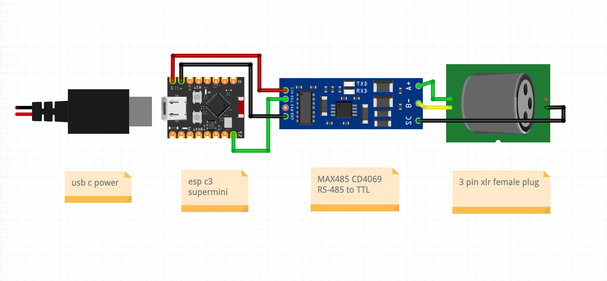
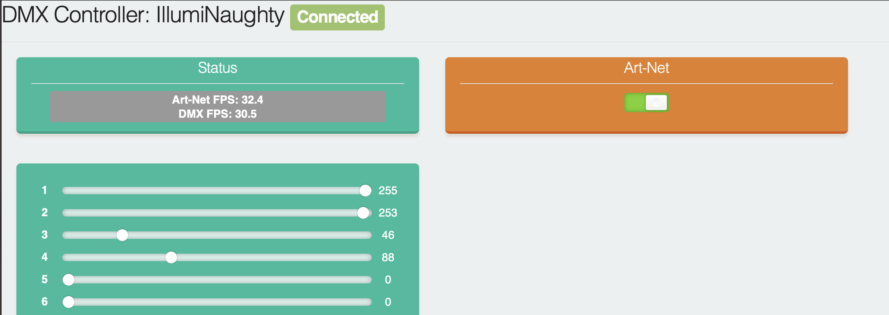

# ESP32 Art-Net to DMX512 Bridge

This is a fork of [robertoostenveld/esp8266_artnet_dmx512](https://github.com/robertoostenveld/esp8266_artnet_dmx512) that has been modernized and simplified for ESP32 platforms.

## Key Differences from Original

- Migrated to ESP32 platform and its native interfaces
- Restructured codebase for improved readability and maintainability
- Removed UART interface in favor of SPI for reduced jitter
- Removed LED status indicators
- Replaced web interface with a simpler UI that shows first 32 DMX channels for testing
- Removed I2S_SUPER_SAFE mode
- Hardcoded Art-Net universe setting
- Migrated to PlatformIO for better dependency management

# Wiring scheme

# Webserver

